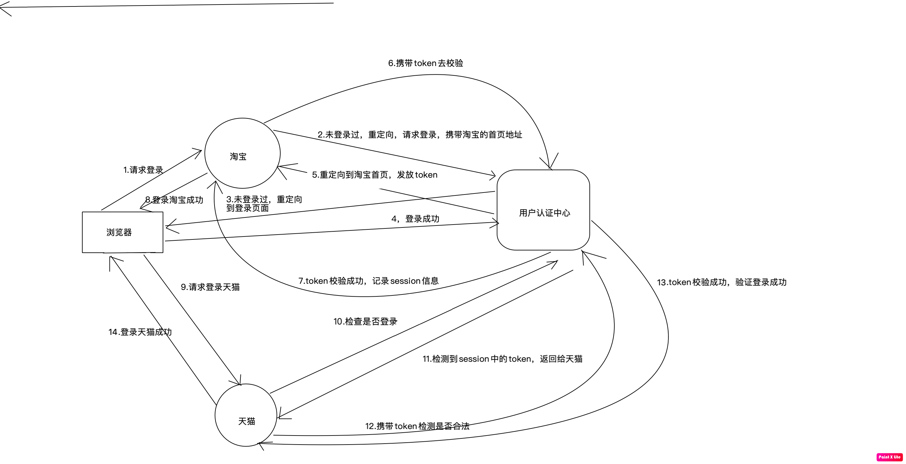

# cas单点登录的源码实现

本文所示内容，使用springboot简化开发，没有使用cas单点登录server端以及client端的第三方包，旨在通过代码梳理cas单点登录的原理

## hosts配置

```shell 
127.0.0.1       www.sso.com
127.0.0.1       www.tb.com
127.0.0.1       www.tm.com
```
## 项目架构说明
- cas-sys是整个项目的父工程
- cas-server继承于cas-sys，是cas单点登录的统一认证中心
- taobao继承于cas-sys，是cas单点登录的一个客户端
- tmall继承于cas-sys，是cas单点登录的一个客户端


## 如何运行

1. 分别启动三个子工程
2. 访问[淘宝](http://www.tb.com:8082/taobao)
3. 访问[天猫](http://www.tm.com:8083/tmall)
4. 在<code>天猫</code>或者<code>淘宝</code>任意一个登录
5. 再次访问没有登录的那一个客户端

## 项目设计解析
当访问淘宝的 **http://www.tb.com:8082/taobao** 地址时，由于淘宝设置了全局的拦截器，此时会走到
interceptor包内的LoginInterceptor的preHandler方法，此时会首先检查session中是否存在isLogin
标识，如果存在了，证明已经登录过了，那么拦截器返回true，放行这个请求。但是第一次请求的时候，session
中是肯定不存在登录信息的。在这种情况下，就要去重定向到统一认证中心这个项目，请求的地址是checkLogin
在服务端的checkLogin这个方法中，会判断session里面有没有token信息，如果没有，就会重定向到服务端的
登录页面，这里面的关键点是，淘宝请求到checkLogin的时候，会携带一个参数，告诉服务端我是从哪里来的，
checkLogin这个方法如果检测到没有token信息进行重定向到登录页面的时候，也会携带这个参数redirectUrl，
在登录页面，进行登录的时候时候，在login方法中，也会携带这个参数。

接下来是login方法，在这个方法中，首先会校验用户名和密码，如果验证通过了，则会发放一个token给淘宝这个客户端，
然后重定向到淘宝，淘宝这个客户端到拦截器又拦截了这个请求，此时还是没有登录信息，那么会去校验这个请求里面
是否有token这个参数，此时确实是存在了token，那么他会带着token再去cas统一认证中心去验证，这个token是否
正确，假如正确的话，那么就说明验证通过了，此时会在淘宝客户端记录一个session证明登录成功了，然后放行重定向
的请求。

此时登录天猫的时候，流程同淘宝，但是当天猫的客户端重定向到统一认证中心的时候，会发现这个浏览器已经存在了
一个登录的session，在session中记录了token，于是天猫客户端也拿着token去统一认证中心去校验，此时流程
就和上面介绍的淘宝一样了，因此此实现了免登录即可访问。

## 原理图解析

